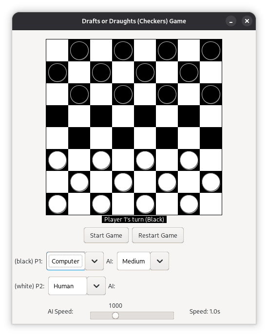

# Java Draughts Game — DSA Coursework



> **Course**: Data Structures and Algorithms  
> **Authors**: Group 3 — Precious, Gideon, Peter  
> **Language**: Java 21+ (Swing GUI)

A lightweight, memory-optimized 8x8 Draughts game implemented in Java Swing. Features a single-player mode against an automated AI opponent powered by a recursive **Minimax Game Tree Search** algorithm.

---

## Key DSA Concepts Implemented

1. **Memory-Optimized Board Array (`Board.java`)**: Represents playable dark tiles using a compact 32-element 1D integer array (`int[32] state`), avoiding memory waste on unusable light tiles.
2. **Coordinate Graph Mapping (`Board.java`)**: Closed-form mathematical formulas map 2D grid coordinates (x,y) to 1D vertex array indices 0..31.
3. **Game Trees & Depth-First Search (`ComputerPlayer.java`)**: Evaluates board state outcomes by building a recursive Game Tree explored down to Depth 3 via Depth-First Search (DFS).
4. **Material Heuristic Scoring (`ComputerPlayer.java`)**: Evaluates leaf nodes in O(1) constant time based on material count difference: (AI material) - (Opponent material).
5. **Rule Validation & Forced Captures (`MoveLogic.java`)**: Enforces official rules, including mandatory capture jumps and diagonal vector displacement.

---

## Build & Run Instructions

### Prerequisites
- **Java Development Kit (JDK 21 or higher)**

### Recommended Command (Compile to bin/ & Run)

```bash
# 1. Compile source files cleanly into the bin/ output directory
javac --release 21 -d bin model/*.java logic/*.java ui/*.java

# 2. Run the application from bin/
java -cp bin ui.Main
```

---

## What Does -d bin Do?

When compiling Java code, the **`-d`** flag stands for **Destination Directory**:

- **`-d bin`**: Tells `javac` to place all compiled `.class` bytecode files inside the `bin/` directory.
- **Package Auto-Creation**: `javac` automatically creates package subfolders inside `bin/` (e.g. `bin/model/Board.class`, `bin/logic/MoveGenerator.class`, `bin/ui/Main.class`).
- **Clean Source Tree**: Keeps your source code folders (`model/`, `logic/`, `ui/`) clean and clutter-free, containing **only `.java` files**.

---

## Project Structure

```
Draughts-GUI-Java/
├── bin/                    # Compiled .class files (generated by javac -d bin)
├── model/                  # Data structures and core game models
│   ├── Board.java          # 32-tile array representation & coordinate conversions
│   ├── Move.java           # Data class for move actions (startIndex, endIndex, weight)
│   ├── Game.java           # Game state engine, turn manager & draw detector
│   └── ComputerPlayer.java # AI decision engine (Minimax tree search + heuristic)
├── logic/                  # Pure rule validation & move generation
│   ├── MoveGenerator.java  # Graph neighbor lookups (1-step diagonal & 2-step skips)
│   └── MoveLogic.java      # Rule engine (diagonal validity & forced captures)
├── ui/                     # Swing GUI view & interaction handlers
│   ├── Main.java           # System entry point
│   ├── CheckersWindow.java # Main JFrame application window
│   ├── OptionPanel.java    # Control panel (Start/Restart, P1/P2 Human/Computer)
│   └── CheckerBoard.java   # Visual renderer (paint) & input event controller
├── temp/
│   └── guide.md            # Detailed study guide & presentation defense QA
└── README.md               # Project documentation
```

---

## How to Play

1. Launch the game using `java -cp bin ui.Main`.
2. Use the **P1** and **P2** dropdown selectors in the bottom panel to choose between **Human** or **Computer** for each side.
3. Click **Start Game** or **Restart Game** to initiate a new session.
4. When it's a Human's turn:
   - Click any checker to highlight available legal diagonal moves (green) or capture jumps (gold/orange).
   - Click a highlighted target tile to execute the move.
